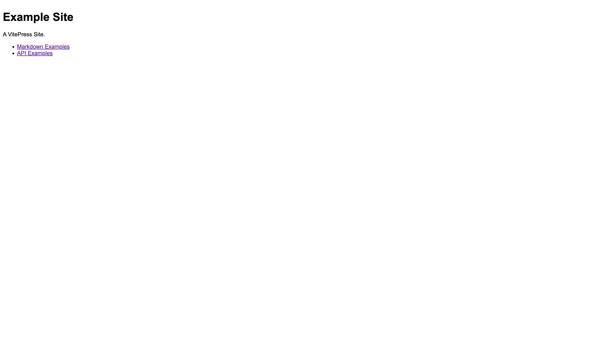
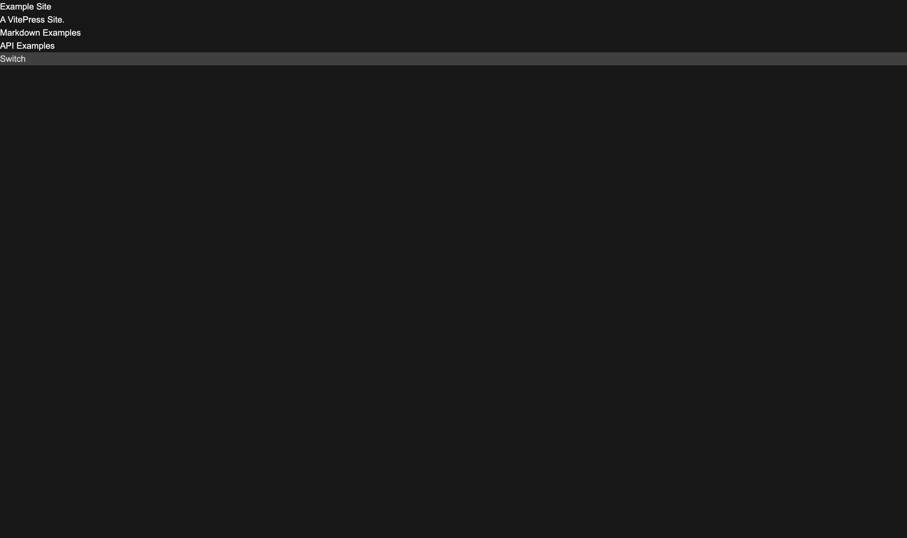

从零开始搭建博客网站（二）：开发环境、`.gitignore`、格式化与黑暗模式。

---

[[toc]]

## 开发环境

注意到初始化后， `./package.json` 中存在以下脚本：

```json
{
  "scripts": {
    "docs:dev": "vitepress dev docs",
    "docs:build": "vitepress build docs",
    "docs:preview": "vitepress preview docs"
  },
  // ...
}
```

即，我们可以通过 `npm run docs:dev` 启动开发服务器，通过 `npm run docs:build` 构建静态文件，通过 `npm run docs:preview` 预览构建后的静态文件。开发环境服务器默认运行在 `http://localhost:5173/`。而预览静态文件的服务器则运行在 `http://localhost:4173/`。

运行 `npm run docs:dev` 后，注意到多出了 `./docs/.vitepress/cache/` 文件夹。这是用于存储开发服务器缓存的文件夹。

运行 `npm run docs:build` 后，注意到多出了 `./docs/.vitepress/dist/` 文件夹，这是用于存储生产环境构建文件的文件夹。

注意，如果您的系统或浏览器处于黑暗模式，下面这张图可能会亮瞎您的眼睛。（虽然这个提醒可能有点晚了，ごめん :face_holding_back_tears: ）



## `.gitignore`

由上面的介绍可知，部分文件夹是不需要提交到仓库的，如 `./docs/.vitepress/cache/`。可以通过 `.gitignore` 文件来忽略这些文件夹：

::: code-group

```txt [./docs/.gitignore]
node_modules/
docs/.vitepress/cache/
```

:::

需要说明的是，如果使用 GitHub Actions 等 CI/CD 工具，则应将 `./docs/.vitepress/dist/` 文件夹加入 `.gitignore` 文件，因为 GitHub Actions 会自动构建静态文件，这也是较为常规的做法。如果不使用这类工具，则理论上（因为我没实践过）你只能在本地手动完成构建后再推送到仓库，这种情况下不要将 `./docs/.vitepress/dist/` 文件夹忽略。（忽略了你还部署个什么呢？）

现在，我们可以将 `.gitignore` 文件提交到仓库。

## 格式化

你可以使用任意一种你喜欢的代码格式化工具，这里我使用 [Prettier](https://prettier.io/)。具体的 [安装使用方法](https://prettier.io/docs/en/install) 以及 [在编辑器中的配置](https://prettier.io/docs/en/editors)，请参考官方文档。

这里我给出我自己的配置文件：

::: code-group

```js [./prettier.config.js]
const config = {
  plugins: [
    "prettier-plugin-tailwindcss",
    "prettier-plugin-multiline-arrays",
  ],

  multilineArraysWrapThreshold: 1,

  experimentalTernaries: true,
  // boolean
  // default: false

  printWidth: 200,
  // int
  // default: 80
  tabWidth: 2,
  // int
  // default: 2
  tabs: false,
  // boolean
  // default: false
  semi: true,
  // boolean
  // default: true
  singleQuote: false,
  // boolean
  // default: false
  quoteProps: "consistent",
  // "as-needed" | "consistent" | "preserve"
  // default: 'as-needed'
  jsxSingleQuote: false,
  // boolean
  // default: false
  trailingComma: "all",
  // "es5" | "none" | "all"
  // default: 'all'
  bracketSpacing: true,
  // boolean
  // default: true
  bracketSameLine: false,
  // boolean
  // default: false
  arrowParens: "always",
  // "always" | "avoid"
  // default: 'always'
  rangeStart: 0,
  // int
  // default: 0
  rangeEnd: Infinity,
  // int
  // default: Infinity
  requirePragma: false,
  // boolean
  // default: false
  insertPragma: false,
  // boolean
  // default: false
  proseWrap: "never",
  // "always" | "never" | "preserve"
  // default: 'preserve'
  htmlWhitespaceSensitivity: "css",
  // "css" | "strict" | "ignore"
  // default: 'css'
  vueIndentScriptAndStyle: false,
  // boolean
  // default: false
  endOfLine: "lf",
  // "lf" | "crlf" | "cr"
  // default: 'lf'
  embeddedLanguageFormatting: "auto",
  // "auto" | "off"
  // default: 'auto'
  singleAttributePerLine: true,
  // boolean
  // default: false
};

export default config;
```

:::

要抄的话，记得安装顶上那两个 `prettier-plugin-tailwind` 和 `prettier-plugin-multiline-arrays`。

还有一个问题需要解决。在 VitePress 中，使用 ES Module 而非 CommonJS 是更被推荐的方式。要使用 ES Module，我们可以使用 `config.mts` 文件名而非 `config.ts`，这也正是 VitePress 默认的配置文件名，它显式声明了文件的模块类型。另一种方式是在 `package.json` 中添加 `"type": "module"` 字段，这样所有的 `.js` 文件都会被当作 ES Module 处理而不需要显式声明：

```json [./package.json]
{
  // ...
  "type": "module"
}
```

此外，可以将 `tailwind.config.js` 和 `postcss.config.js` 的导出方式改为 ES Module 的方式以统一风格：

::: code-group

```js [./tailwind.config.js]
// module.exports = {  // [!code --]
export default {  // [!code ++]
  content: [],
  theme: {
    extend: {},
  },
  plugins: [],
};
```

```js [./postcss.config.js]
// module.exports = {  // [!code --]
export default {  // [!code ++]
  plugins: {
    tailwindcss: {},
    autoprefixer: {},
  },
};
```

:::

## 黑暗模式｜Dark Mode

### 统一口径

黑暗模式、夜间模式、深色模式……不管怎么称呼，在这里都指网页的黑暗模式，后文中统一称「黑暗模式」。而系统的深色或浅色，我们在这里称「用户偏好模式」。

### 准备工作

在 [文档](https://vitepress.dev/reference/site-config#appearance) 中我们可以看到，VitePress 支持黑暗模式。可以通过更改用户偏好模式来查看效果。但是你会发现没有效果 :smile: ，这是因为我们使用的是自定义主题，并没有针对黑暗模式设计样式。

这里开始，我们要正式进入 Tailwind 的使用。首先需要声明在哪些文件中使用 Tailwind，在 `./tailwind.config.js` 中编辑 `content` 字段：

```js
/** @type {import('tailwindcss').Config} */
export default {
  content: [
    "./docs/.vitepress/theme/Layout.vue",  // [!code ++:2]
    "./docs/.vitepress/theme/**/*.{vue,js,ts,jsx,tsx}",
  ],
  theme: {
    extend: {},
  },
  plugins: [],
};
```

然后在 `./docs/.vitepress/theme/style.css` 顶部添加 Tailwind 模块：

```css
@tailwind base;
@tailwind components;
@tailwind utilities;
```

同时，就算不在 `style.css` 中写样式（实际上是需要在里面写的），也要确保 `style.css` 文件在 `./docs/.vitepress/theme/index.ts` 中被引入：

::: code-group

```ts [./docs/.vitepress/theme/index.ts]
// https://vitepress.dev/guide/custom-theme
import Layout from "./Layout.vue";
import type { Theme } from "vitepress";
import "./style.css";  // [!code focus]

export default {
  Layout,
    // ...
  enhanceApp({ app, router, siteData }) {
  },
} satisfies Theme;
```

```js [./docs/.vitepress/theme/index.js]
// https://vitepress.dev/guide/custom-theme
import Layout from './Layout.vue'
import './style.css'  // [!code focus]

/** @type {import('vitepress').Theme} */
export default {
  Layout,
  enhanceApp({ app, router, siteData }) {
    // ...
  }
}
```

:::

### `Layout.vue` 的 DOM 结构

::: code-group

```vue [./docs/.vitepress/theme/Layout.vue]
<script setup lang="ts">
import { useData } from "vitepress";

// https://vitepress.dev/reference/runtime-api#usedata
const { site, frontmatter } = useData();
</script>

<template>
  <div v-if="frontmatter.home">
    <h1>{{ site.title }}</h1>
    <p>{{ site.description }}</p>
    <ul>
      <li><a href="/markdown-examples.html">Markdown Examples</a></li>
      <li><a href="/api-examples.html">API Examples</a></li>
    </ul>
  </div>
  <div v-else>
    <a href="/">Home</a>
    <Content />
  </div>
</template>
```

:::

可以看到，默认的 DOM 结构中并没有将整个页面包裹在一个 `div` 中，也就意味着我们无法直接在 `Layout.vue` 中为整个页面添加样式。第一种方案是在 `Layout.vue` 中添加一个 `div`，将整个页面包裹在这个 `div` 中，然后使用 Tailwind CSS 为这个 `div` 添加样式。第二种方案是在 `style.css` 中为 `body` 添加样式。这里我们选择第二种方案。

### 添加黑暗模式样式

Tailwind CSS 的黑暗模式是通过 `@media (prefers-color-scheme: dark)` 来实现的，即检测用户偏好模式。我们可以在 `style.css` 中添加黑暗模式的样式：

::: code-group

```css [./docs/.vitepress/theme/style.css]
body {
  @apply dark:bg-neutral-900 dark:text-neutral-100;
}
```

:::

现在，可以通过更改用户偏好模式来查看效果。



### 手动切换黑暗模式

#### 配置

Tailwind CSS 的 `dark:` 修饰符默认通过检测用户偏好模式来切换样式。可以通过在 Tailwind 配置文件中修改 `darkMode` 选项来改为使用选择器识别：

::: code-group

```js [./tailwind.config.js]
/** @type {import('tailwindcss').Config} */
export default {
  content: [
    "./docs/.vitepress/theme/Layout.vue",
    "./docs/.vitepress/theme/**/*.{vue,js,ts,jsx,tsx}",
  ],
  theme: {
    extend: {},
  },
  plugins: [],
  darkMode: "selector",  // [!code ++]
};
```

:::

这样配置之后，`dark:` 的应用条件将变为 `.dark` 选择器的存在。可以自己写函数来向 `html` 元素添加 `dark` 类名，从而手动切换黑暗模式。同时 VitePress 的站点配置中有一项 `appearance`，可以根据用户偏好模式来向 `html` 元素添加 `dark` 类名。这个配置项默认为 `true`。打开浏览器的开发者工具，可以看到当用户偏好模式设置为深色时，`html` 元素会添加 `dark` 类名。这样一来，我们可以在尊重用户偏好模式的同时，进行手动切换。

具体怎么实现，接着看看。

#### 其中一种实现方式

在 `Layout.vue` 中添加一个「按钮」（任意位置都可以，反正以后要改 :joy: ），并监听 `click` 事件，切换 `html` 元素的 `dark` 类名：

::: code-group

```vue [./docs/.vitepress/theme/Layout.vue(ts)]
<script setup lang="ts">
import { useData } from "vitepress";

// https://vitepress.dev/reference/runtime-api#usedata
const { site, frontmatter } = useData();

const switchDarkMode = (): void => {  // [!code ++:4]
  const htmlEl: HTMLElement | null = document.querySelector("html");
  htmlEl?.classList.toggle("dark");
};
</script>

<template>
  <div v-if="frontmatter.home">
    <h1>{{ site.title }}</h1>
    <p>{{ site.description }}</p>
    <ul>
      <li><a href="/markdown-examples.html">Markdown Examples</a></li>
      <li><a href="/api-examples.html">API Examples</a></li>
    </ul>
  </div>
  <div v-else>
    <a href="/">Home</a>
    <Content />
  </div> <!-- [!code ++:+1] --> <!-- [!code ++:+2] --> <!-- [!code ++:+3] --> <!-- [!code ++:+4] -->
  <div
    class="dark-mode-switcher bg-neutral-300 text-neutral-700 dark:bg-neutral-700 dark:text-neutral-300"
    @click="switchDarkMode"
  >
    Switch  <!-- [!code ++:2] -->
  </div>
</template>
```

```vue [./docs/.vitepress/theme/Layout.vue(js)]
<script setup>
import { useData } from "vitepress";

// https://vitepress.dev/reference/runtime-api#usedata
const { site, frontmatter } = useData();

const switchDarkMode = () => {  // [!code ++:4]
  const htmlEl = document.querySelector("html");
  htmlEl?.classList.toggle("dark");
};
</script>

<template>
  <div v-if="frontmatter.home">
    <h1>{{ site.title }}</h1>
    <p>{{ site.description }}</p>
    <ul>
      <li><a href="/markdown-examples.html">Markdown Examples</a></li>
      <li><a href="/api-examples.html">API Examples</a></li>
    </ul>
  </div>
  <div v-else>
    <a href="/">Home</a>
    <Content />
  </div> <!-- [!code ++:+1] --> <!-- [!code ++:+2] --> <!-- [!code ++:+3] --> <!-- [!code ++:+4] -->
  <div
    class="dark-mode-switcher bg-neutral-300 text-neutral-700 dark:bg-neutral-700 dark:text-neutral-300"
    @click="switchDarkMode"
  >
    Switch  <!-- [!code ++:2] -->
  </div>
</template>
```

:::

完毕。
