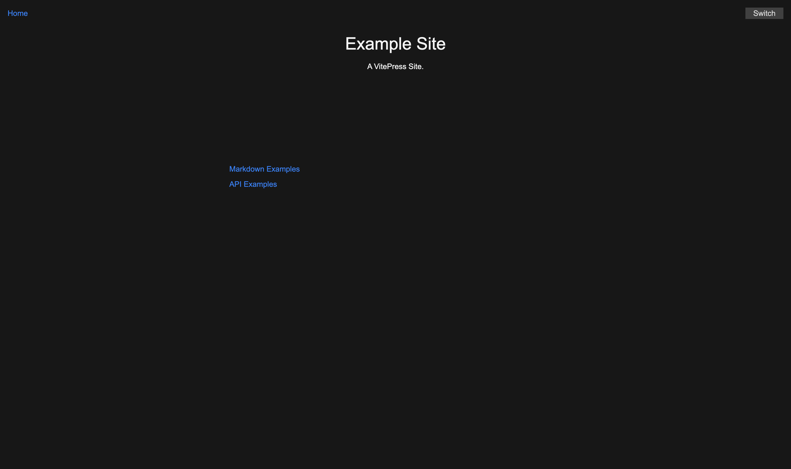
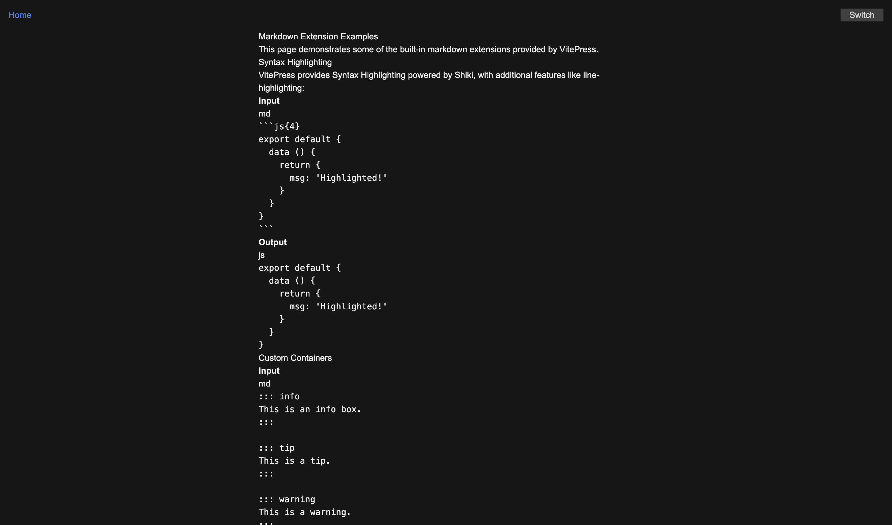
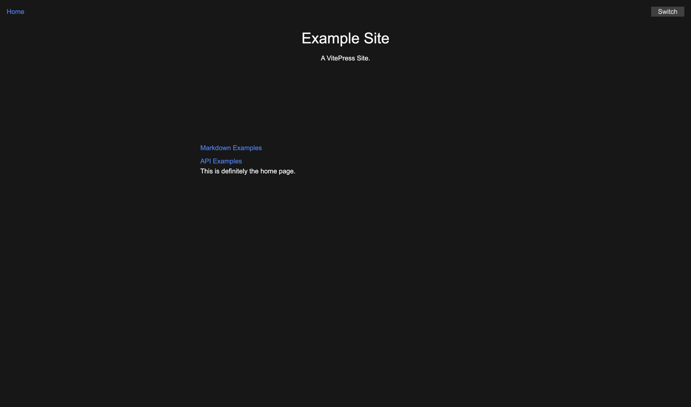
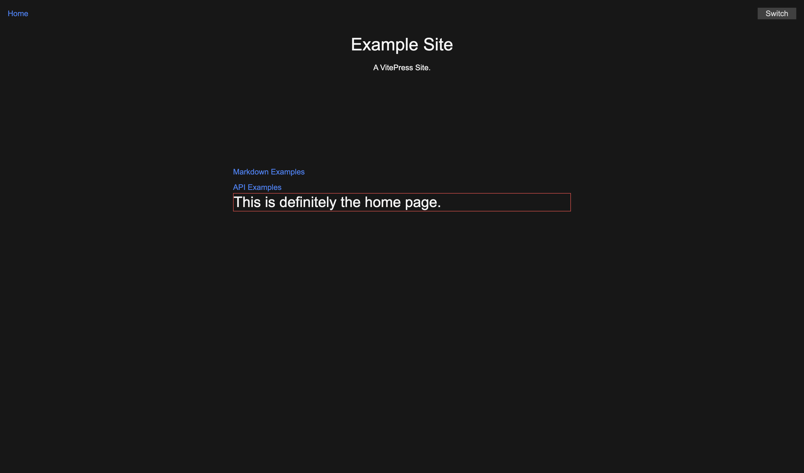
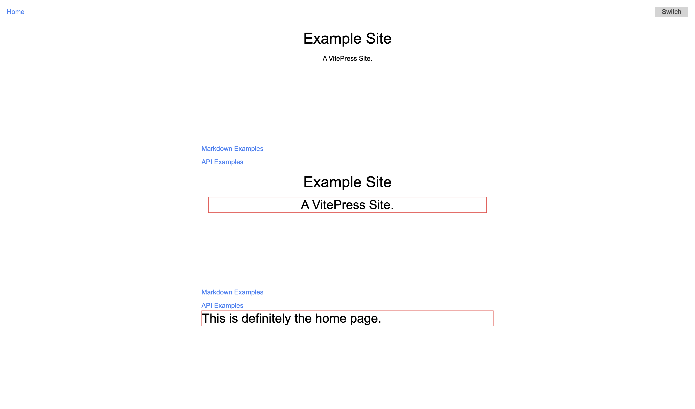

从零开始搭建博客网站（三）：像样的页面与文件结构优化。

---

[[toc]]

## 像样的页面

### 现状

是的，现在的页面可读性几乎为零。这篇文章的目标是在样式和结构上进行设计。

### VitePress 的页面结构

首先，对 Vue 有过了解的读者可能会比较清楚，整个页面——或者说是整个应用——挂载在 `#app` 这个 DOM 元素上。在 `index.ts` 中交代了一些信息：

::: code-group

```ts [./docs/.vitepress/index.ts]
// @noErrors
// https://vitepress.dev/guide/custom-theme
import Layout from "./Layout.vue";  // [!code focus]
import type { Theme } from "vitepress";
import "./style.css";

export default {
  Layout,  // [!code focus]
  enhanceApp({ app, router, siteData }) {
    // ...
  },
} satisfies Theme;
```

:::

这告诉我们，`Layout.vue` 是整个页面的总体布局，且根据 `Theme` 类型的定义，`Layout` 实质上是 `Theme` 唯一一个必要的属性。[文档](https://vitepress.dev/guide/custom-theme#theme-interface) 称「*So technically, a VitePress theme can be as simple as a single Vue component*」，也就是说，所有的结构都可以仅在 `Layout.vue` 中定义。但是为了更好地组织代码，我们也可以在 `Layout.vue` 中引入其他组件，像一个真正的 Vue 应用一样。

再次看看 `Layout.vue` 的代码：

::: code-group

```vue [./docs/.vitepress/theme/Layout.vue]
<script setup lang="ts">
import { useData } from "vitepress";

// https://vitepress.dev/reference/runtime-api#usedata
const { site, frontmatter } = useData();

const switchDarkMode = (): void => {
  const htmlEl: HTMLElement | null = document.querySelector("html");
  htmlEl?.classList.toggle("dark");
};
</script>

<template>
  <div v-if="frontmatter.home">
    <h1>{{ site.title }}</h1>
    <p>{{ site.description }}</p>
    <ul>
      <li><a href="/markdown-examples.html">Markdown Examples</a></li>
      <li><a href="/api-examples.html">API Examples</a></li>
    </ul>
  </div>
  <div v-else>
    <a href="/">Home</a>
    <Content />
  </div>
  <div
    class="dark-mode-switcher bg-neutral-300 text-neutral-700 dark:bg-neutral-700 dark:text-neutral-300"
    @click="switchDarkMode"
  >
    Switch
  </div>
</template>
```

:::

在 `<template>` 中，我们可以看到基于 `frontmatter.home` 的条件渲染。`frontmatter` 是 MD 文件的元数据，这意味着如果当前页面对应的 MD 文件的 YAML 头中有 `home: true`，则会渲染 `site.title`、`site.description` 等首页内容。否则，会渲染一个返回首页的链接和 `<Content>` 组件。`<Content>` 组件是 VitePress 的内置组件，用于将当前页面对应的 MD 文件渲染为 HTML。

### 初步设计

为了便于区分，我们先微调一下 `Layout.vue` 的结构，并加上一些样式：

::: code-group

```vue [./docs/.vitepress/theme/Layout.vue] {6,8,13,18,20,23,24,27-29,34}
<script setup lang="ts">
// ...
</script>

<template>
  <nav class="flex justify-between p-4">
    <a
      class="text-blue-500 hover:underline"
      href="/"
      >Home</a
    >
    <div
      class="dark-mode-switcher w-20 bg-neutral-300 text-center text-neutral-700 dark:bg-neutral-700 dark:text-neutral-300"
      @click="switchDarkMode"
    >
      Switch
    </div>
  </nav>
  <div
    class="mx-auto max-w-[700px]"
    v-if="frontmatter.home"
  >
    <h1 class="m-4 text-center text-4xl">{{ site.title }}</h1>
    <div class="m-4 min-h-[200px] text-center">
      <p>{{ site.description }}</p>
    </div>
    <ul class="flex flex-col space-y-2">
      <li class="text-blue-500"><a href="/markdown-examples.html">Markdown Examples</a></li>
      <li class="text-blue-500"><a href="/api-examples.html">API Examples</a></li>
    </ul>
  </div>
  <div
    v-else
    class="mx-auto max-w-[700px]"
  >
    <Content />
  </div>
</template>
```

:::

这样，我们就有了一个简单的导航栏和一个居中的内容区域，如下图所示：





### 主页的特殊处理

注意到 `./docs/` 目录下存在一个 `index.md` 文件，这就是主页的 MD 文件，同样通过 `<Content />` 组件渲染。注意到在 `Layout.vue` 中，`<Content />` 组件的渲染是在 `v-else` 分支中，这意味着当 `frontmatter.home` 为 `true` 时，`<Content />` 组件不会被渲染。我们可以试着把 `<Content />` 组件放在分支外，并向 `index.md` 文件中添加一些内容：

::: code-group

```vue [./docs/.vitepress/theme/Layout.vue] {10,11}
<script setup lang="ts">
// ...
</script>

<template>
  <!-- ... -->
  <div
    v-else
    class="mx-auto max-w-[700px]"
  ></div>
  <Content class="mx-auto max-w-[700px]" />
</template>
```

```markdown [./docs/index.md]
---
home: true
---

This is definitely the home page.  <!-- [!code ++] -->
```

:::

现在可以看到，主页的内容用一样的方式渲染了出来：



不过我想说，主页是一个特殊的页面，主页内容的样式应该与其他页面有所区别，谁支持谁反对？有很多种思路可以实现主页的特殊处理。

#### 保留 `index.md` 内容，通过 `frontmatter` 区分

根据前面的讨论，其中一种方案是：我们可以通过在 `index.md` 的 YAML 头中添加一些独特的元数据来区分主页和普通页面，如默认的 `home: true`。在这个基础上，我们可以在 `Layout.vue` 中根据 `frontmatter` 的值来为主页 `<Content />`（或其相对于普通页面特有的祖先元素）添加类名，以便在 `style.css` 中进行样式设计：

::: code-group

```vue [./docs/.vitepress/theme/Layout.vue]
<script setup lang="ts">
// ...
</script>

<template>
  <!-- ... -->  <!-- [!code ++:+3] --> <!-- [!code ++:+4] -->
  <Content
    class="mx-auto max-w-[700px]"
    id="content"
    :class="frontmatter.home ? 'home-page' : ''"
  />
</template>
```

```css [./docs/.vitepress/theme/style.css]
/* ... */

#content {  /* [!code ++:7] */
  &.home-page {
    p {
      @apply border border-red-500 text-3xl;
    }
  }
}

```

:::

这样一来，加载在主页上的 `<Content />` 组件的内容就会被添加上 `home-page` 类名，从而可以在 `style.css` 中对其进行样式设计。这里我们简单地添加了一个红色的边框和大字体样式。



除了通过 `frontmatter`，还可以通过其他方式区分主页和普通页面，比如通过文件名、文件路径等。这里只是提供了一种思路。

#### `index.md` 空空如也

另一种思路是，反正 `index.md` 的内容是被渲染为 HTML 的，为何不直接在 `Layout.vue` 中写入主页的内容呢？事实上这正是初始化时的默认行为，`site.title`、`site.description` 以及紧跟的文章列表（两个也是列表）都直接写在 `<template>` 中。这样做的最大优势是更加灵活，因为我们实际上是在写 Vue 组件，可以随心所欲地添加任何内容，而不用受到 MD 文件结构的限制。

#### （算是？）某种奇技淫巧：在 MD 文件中使用 Vue

事实上，由于每个 MD 文件都将被编译为 HTML，然后作为 [Vue SFC](https://vuejs.org/guide/scaling-up/sfc.html) 来处理。这意味着我们可以在 MD 文件中使用任何 Vue 功能。在这个例子中，我们可以直接将 `index.md` 中的内容写为 Vue 模板，从而实现更加灵活的内容设计，并且使用 TailwindCSS 的类名为其添加样式：

```md [./docs/index.md]
---
home: true
---

<script setup lang="ts">  // [!code ++:2]
import { useData } from 'vitepress'

const { site } = useData()  // [!code ++:2]
</script>

<h1 class="m-4 text-center text-4xl">{{ site.title }}</h1>  <!-- [!code ++:8] -->
<div class="m-4 min-h-[200px] text-center">
  <p>{{ site.description }}</p>
</div>
<ul class="flex flex-col space-y-2">
  <li class="text-blue-500"><a href="/markdown-examples.html">Markdown Examples</a></li>
  <li class="text-blue-500"><a href="/api-examples.html">API Examples</a></li>
</ul>

This is definitely the home page.
```

看看效果：



注意到两点：首先，`<p>` 标签的样式同样应用了 `style.css` 中的红色边框和大字体样式，懂了吗？懂了过了。其次，由于 `<Content />` 组件的均在 `Layout.vue` 中渲染，所以 Tailwind 也可以直接在 MD 文件中使用。

好了，把刚刚魔改的部分删除，把 `index.md` 的添加的那行文字也删掉，样式表也删掉，我们直接在 `Layout.vue` 中进行主页设计。

## 文件结构优化

我们当然可以在 `Layout.vue` 中实现所有的页面设计，但是我们当然不可以在 `Layout.vue` 中实现所有的页面设计（ :sweat_drops: ）。现在，让我们将 `Layout.vue` 中的内容拆分开来。这里我的拆分思路是：将顶部导航栏和底部可能存在的页脚拆分为 PageNav 和 PageFooter，主要内容区域放在 PageContent 中，再具体区分 PageContentHome 和 PageContentPost。这样，我们就可以在 `Layout.vue` 中引入这些组件，而不用在 `Layout.vue` 中写一堆。

在 `./docs/.vitepress/theme` 目录下新建 `components/` 目录，然后新建文件写东西：

::: code-group

```vue [./docs/.vitepress/theme/components/PageNav.vue]
<script setup lang="ts">
const switchDarkMode = (): void => {
  const htmlEl: HTMLElement | null = document.querySelector("html");
  htmlEl?.classList.toggle("dark");
};
</script>

<template>
  <nav class="flex justify-between p-4">
    <a
      class="text-blue-500 hover:underline"
      href="/"
      >Home</a
    >
    <div
      class="dark-mode-switcher w-20 bg-neutral-300 text-center text-neutral-700 dark:bg-neutral-700 dark:text-neutral-300"
      @click="switchDarkMode"
    >
      Switch
    </div>
  </nav>
</template>
```

```vue [./docs/.vitepress/theme/components/PageFooter.vue]
<script setup lang="ts"></script>

<template></template>
```

```vue [./docs/.vitepress/theme/components/PageContent.vue]
<script setup lang="ts">
import { useData } from "vitepress";
import PageContentHome from "./PageContentHome.vue";
import PageContentPost from "./PageContentPost.vue";

const { frontmatter } = useData();
</script>

<template>
  <PageContentHome v-if="frontmatter.home" />
  <PageContentPost v-else />
</template>
```

```vue [./docs/.vitepress/theme/components/PageContentHome.vue]
<script setup lang="ts">
import { useData } from "vitepress";

const { site } = useData();
</script>

<template>
  <div class="mx-auto max-w-[700px]">
    <h1 class="m-4 text-center text-4xl">{{ site.title }}</h1>
    <div class="m-4 min-h-[200px] text-center">
      <p>{{ site.description }}</p>
    </div>
    <ul class="flex flex-col space-y-2">
      <li class="text-blue-500"><a href="/markdown-examples.html">Markdown Examples</a></li>
      <li class="text-blue-500"><a href="/api-examples.html">API Examples</a></li>
    </ul>
  </div>
</template>
```

```vue [./docs/.vitepress/theme/components/PageContentPost.vue]
<script setup lang="ts"></script>

<template>
  <Content
    class="mx-auto max-w-[700px]"
    id="content"
  />
</template>
```

:::

然后在 `Layout.vue` 中引入这些组件：

::: code-group

```vue [./docs/.vitepress/theme/Layout.vue] {2-4,9-10}
<script setup lang="ts">
import PageNav from "./components/PageNav.vue";
import PageContent from "./components/PageContent.vue";
import PageFooter from "./components/PageFooter.vue";
</script>

<template>
  <PageNav />
  <PageContent />
  <PageFooter />
</template>
```