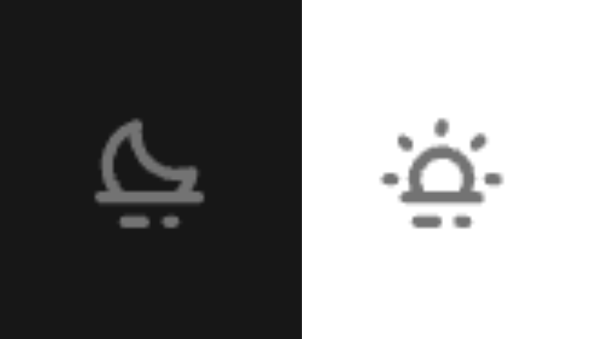

从零开始搭建博客网站（四）：更好的黑暗模式。

---

[[toc]]

## 更好的黑暗模式

### 怎么个事

在 [这个系列的第二篇文章](build_a_blog_site_2.md) 中，我们已经实现了尊重用户偏好模式的同时，支持手动切换的黑暗模式功能。进行手动切换的按钮是一个很简单的按钮，没有什么特殊的样式。一般情况下，我们可能会希望这个按钮在黑暗模式开启或关闭时是不同的样式，比如一个太阳和一个月亮。

在这篇文章中，我们将实现首先这个功能。

### 复习

看一下，现在我们的 `PageNav.vue` 文件中有以下内容：

::: code-group

```vue [./docs/.vitepress/theme/components/PageNav.vue]
<script setup lang="ts">
const switchDarkMode = (): void => {
  const htmlEl: HTMLElement | null = document.querySelector("html");
  htmlEl?.classList.toggle("dark");
};
</script>

<template>
  <nav class="flex justify-between p-4">
    <a
      class="text-blue-500 hover:underline"
      href="/"
      >Home</a
    >
    <div
      class="dark-mode-switcher w-20 bg-neutral-300 text-center text-neutral-700 dark:bg-neutral-700 dark:text-neutral-300"
      @click="switchDarkMode"
    >
      Switch
    </div>
  </nav>
</template>
```

:::

可以看到，我们使用一个 `switchDarkMode()` 函数来切换黑暗模式。它做的工作很简单——在 `<html>` 元素上切换 `dark` 类。

### 响应式状态

要实现在黑暗模式下不同按钮状态，我们需要一个响应式状态：

::: code-group

```vue [PageNav.vue (ts)] twoslash
<script setup lang="ts">
// @errors: 18047
import { onMounted, ref, triggerRef } from "vue";

const htmlEl: HTMLElement | null = document.querySelector("html");
//    ^?

let darkMode = ref({
  get state(): boolean {
    return htmlEl.classList.contains("dark");
  },

  set state(value: boolean) {
    toggleDarkClass(value);
  },
});

const toggleDarkClass = (value: boolean) => {
  console.log("Toggle Dark Class " + value);

  if (value) {
    htmlEl.classList.add("dark");
  } else {
    htmlEl.classList.remove("dark");
  }
};
</script>

<template>
  <!-- ... -->
</template>
```

```vue [PageNav.vue (js)]
<script setup>
import { onMounted, ref, triggerRef } from "vue";

const htmlEl = document.querySelector("html");

let darkMode = ref({
  get state() {
    return htmlEl.classList.contains("dark");
  },

  set state(value) {
    if (value) {
      htmlEl.classList.add("dark");
    } else {
      htmlEl.classList.remove("dark");
    }
  },
});

const toggleDarkClass = (value) => {
  if (value) {
    htmlEl.classList.add("dark");
  } else {
    htmlEl.classList.remove("dark");
  }
};
</script>

<template>
<!-- ... -->
</template>
```

:::

我们在 `setup` 函数中定义了一个 `darkMode` 变量，包含名为 `state` 的 `getter` 和 `setter`，用于获取和设置黑暗模式的状态；同时定义有 `toggleDarkClass()` 函数来进行实际的 DOM 操作，即在 `<html>` 元素上切换 `dark` 类。

如果您使用 JS，可以直接跳过至 [模板中的处理](build_a_blog_site_4#模板中的处理)。

从这里开始，我们会对 TypeScript 有更深入的了解。可以看到，上面的代码抛出了错误：`'htmlEl' is possibly 'null'.`，这是因为 `document.querySelector("html")` 可能返回 `null`。我们有多种方式可以解决这个问题。

#### 类型断言｜Type Asertion

有些时候，TypeScript 得出的类型并非我们所期望的。在上面这个例子中，`document.querySelector("html")` 返回的类型是 `Element | null`，而我们希望 `htmlEl` 的类型一定是 `HTMLElement`。我们可以使用类型断言来解决这个问题：

```vue twoslash {5}
<script setup lang="ts">
// ...

// [!code word:as HTMLElement]
const htmlEl = document.querySelector("html") as HTMLElement;
//    ^?
// 也可以使用下面的形式，等价：
// const htmlEl = <HTMLElement>document.querySelector("html");

// ...
</script>

<template>
  <!-- ... -->
</template>
```

我们断言 `htmlEl` 一定是 `HTMLElement`，这样就可以避免报错。需要注意的是，类型断言并不会改变 `htmlEl` 实际的类型，它只是告诉 TypeScript 我们确定 `htmlEl` 一定是 `HTMLElement`，但我们的确定不一定是对的 :sweat_smile: ，所以使用类型断言时要谨慎。

#### 非空断言｜Non-null Assertion

在这个特殊的例子中，因为我们需要「去除」的另一个类型是 `null`。我们可以使用非空断言来解决这个问题：

```vue twoslash {5}
<script setup lang="ts">
// ...

// [!code word:!:1]
const htmlEl = document.querySelector("html")!;
//    ^?

// ...
</script>

<template>
  <!-- ... -->
</template>
```

和上一个方法类似，我们断言 `htmlEl` 一定非空。需要注意的是——同样地——这并不会改变 `htmlEl` 实际的类型。

#### 可选链｜Optional Chaining

可选链用于处理可能为 `null` 或 `undefined` 的值。在 TypeScript 以及 JavaScript 中，对于 `a.b` 这样的调用，如果 `a` 为 `null` 或 `undefined`，则会抛出错误 `Cannot read properties of null (reading 'b')` / `Cannot read properties of undefined (reading 'b')`。使用形如 `a?.b` 的可选链可以避免这种情况，在 `a` 为 `null` 或 `undefined` 时直接返回 `undefined`：

```vue twoslash
<script setup lang="ts">
// @errors: 2322
import { onMounted, ref, triggerRef } from "vue";

const htmlEl: HTMLElement | null = document.querySelector("html");
// [!code word:?]
let darkMode = ref({
  get state(): boolean {
    return htmlEl?.classList.contains("dark");
  },

  set state(value: boolean) {
    toggleDarkClass(value);
  },
});

const toggleDarkClass = (value: boolean) => {
  console.log("Toggle Dark Class " + value);

  if (value) {
    htmlEl?.classList.add("dark");
  } else {
    htmlEl?.classList.remove("dark");
  }
};
</script>

<template>
  <!-- ... -->
</template>

```

所以如你所见，使用可选链会导致另一个问题：`darkMode` 的 `getter` 函数的返回值类型实际上是 `boolean | undefined`，但我们希望它是 `boolean`，虽然可以加入新的验证逻辑去解决，但无疑会增加代码的复杂度。

#### 单独验证

另一种解决方案是单独验证 `htmlEl` 是否为 `null` 或 `undefined`：如果是，则提前抛出错误：

```vue twoslash
<script setup lang="ts">
import { onMounted, ref, triggerRef } from "vue";

const htmlEl: HTMLElement | null = document.querySelector("html");
//    ^?

if (!htmlEl) {  // [!code ++:3]
  throw new Error("HTML element not found");
}

let darkMode = ref({
  get state(): boolean {
    return htmlEl.classList.contains("dark");
    //     ^?
  },

  set state(value: boolean) {
    toggleDarkClass(value);
  },
});

const toggleDarkClass = (value: boolean) => {
  console.log("Toggle Dark Class " + value);

  if (value) {
    htmlEl.classList.add("dark");
  } else {
    htmlEl.classList.remove("dark");
  }
};
</script>

<template>
  <!-- ... -->
</template>
```

可以看到，虽然 `htmlEl` 的类型在定义时确实是 `HTMLElement | null`，但在检查并抛出错误之后，其类型就只剩下了 `HTMLElement`。

这里我们使用最后一种方式来处理。

### 模板中的处理

有了 `darkMode` 这个状态和 `toggleDarkClass()` 函数，我们就可以在模板中实现下面的操作：（顺便设计一下排版和样式）

```vue:line-numbers {7,14,15,40}
<script setup lang="ts">
// ...
</script>

<template>
  <nav class="flex flex-row justify-between p-4">
    <div class="m-2">
      <a
        class="font-[noteworthy] text-5xl text-neutral-800 dark:text-neutral-200"
        href="/"
        >HOME</a
      >
    </div>
    <div class="flex flex-row items-center gap-6 text-xl">
      <a
        class="m-1 flex h-6 w-6 cursor-pointer items-center justify-center text-neutral-500 transition-colors duration-200 hover:text-neutral-700 dark:hover:text-neutral-300"
        href="https://github.com/"
      >
        <svg
          xmlns="http://www.w3.org/2000/svg"
          width="1em"
          height="1em"
          viewBox="0 0 24 24"
        >
          <g
            fill="none"
            stroke="currentColor"
            stroke-linecap="round"
            stroke-linejoin="round"
            stroke-width="1.5"
          >
            <path d="M12 22c5.523 0 10-4.477 10-10S17.523 2 12 2S2 6.477 2 12s4.477 10 10 10" />
            <path
              d="M14.333 19v-1.863c.025-.31-.018-.62-.126-.913a2.2 2.2 0 0 0-.5-.781c2.093-.227 4.293-1 4.293-4.544a3.48 3.48 0 0 0-1-2.434a3.2 3.2 0 0 0-.06-2.448s-.787-.227-2.607.961a9.15 9.15 0 0 0-4.666 0c-1.82-1.188-2.607-.96-2.607-.96A3.2 3.2 0 0 0 7 8.464a3.48 3.48 0 0 0-1 2.453c0 3.519 2.2 4.291 4.293 4.544a2.2 2.2 0 0 0-.496.773a2.1 2.1 0 0 0-.13.902V19"
            />
            <path d="M9.667 17.702c-2 .631-3.667 0-4.667-1.948" />
          </g>
        </svg>
      </a>
      <div
        class="m-1 flex h-6 w-6 cursor-pointer items-center justify-center text-neutral-500 transition-colors duration-200 hover:text-neutral-700 dark:hover:text-neutral-300"
        @click="darkMode.state = htmlEl.classList.contains('dark') ? false : true"
      >
        <svg
          xmlns="http://www.w3.org/2000/svg"
          width="1em"
          height="1em"
          viewBox="0 0 24 24"
          v-if="darkMode.state"
        >
          <path
            fill="currentColor"
            d="M11 19H8a1 1 0 0 0 0 2h3a1 1 0 0 0 0-2m9-4h-1.16A8.2 8.2 0 0 0 20 12.05a1 1 0 0 0-.34-.93a1 1 0 0 0-1-.19a6 6 0 0 1-1.92.32a6.06 6.06 0 0 1-6.06-6a7 7 0 0 1 .1-1a1 1 0 0 0-.35-.92a1 1 0 0 0-1-.18A8.06 8.06 0 0 0 4 10.68A8 8 0 0 0 5.27 15H4a1 1 0 0 0 0 2h16a1 1 0 0 0 0-2m-3.72 0H7.83a6 6 0 0 1 .88-9.36a8.06 8.06 0 0 0 8.05 7.61a7 7 0 0 0 .79 0A6.1 6.1 0 0 1 16.28 15M16 19h-1a1 1 0 0 0 0 2h1a1 1 0 0 0 0-2"
          />
        </svg>
        <svg
          xmlns="http://www.w3.org/2000/svg"
          width="1em"
          height="1em"
          viewBox="0 0 24 24"
          v-else
        >
          <path
            fill="currentColor"
            d="M17.66 8.34a1 1 0 0 0 .7-.29l.71-.71a1 1 0 1 0-1.41-1.41l-.66.71a1 1 0 0 0 0 1.41a1 1 0 0 0 .66.29M12 6a1 1 0 0 0 1-1V4a1 1 0 0 0-2 0v1a1 1 0 0 0 1 1m-8 6H3a1 1 0 0 0 0 2h1a1 1 0 0 0 0-2m1.64-3.95a1 1 0 0 0 .7.29a1 1 0 0 0 .71-.29a1 1 0 0 0 0-1.41l-.71-.71a1 1 0 0 0-1.41 1.41ZM21 12h-1a1 1 0 0 0 0 2h1a1 1 0 0 0 0-2m-10 7H8a1 1 0 0 0 0 2h3a1 1 0 0 0 0-2m7-4h-.88a5.4 5.4 0 0 0 .38-2a5.5 5.5 0 0 0-11 0a5.4 5.4 0 0 0 .38 2H6a1 1 0 0 0 0 2h12a1 1 0 0 0 0-2m-3.15 0h-5.7a3.44 3.44 0 0 1-.65-2a3.5 3.5 0 0 1 7 0a3.44 3.44 0 0 1-.65 2M16 19h-1a1 1 0 0 0 0 2h1a1 1 0 0 0 0-2"
          />
        </svg>
      </div>
    </div>
  </nav>
</template>
```

先讲一下结构变化。之前我们直接把 `<a>` 和切换黑暗模式的按钮放在 `<nav>` 下，当只有两个子元素时是能使其分布在两端的，但是若子元素数量大于两个，则元素会从左到右依次排列。所以在第 7 行和第 14 行，我们把 `<nav>` 分为两个部分，作为导航栏左侧和右侧的区域，实现两端对齐的效果。

在导航栏右侧区域中，加入了一个跳转至 GitHub 仓库的按钮（第 15 行），读者可以将 `href` 属性修改为自己的仓库地址。在第 40 行，我们实现了切换黑暗模式的按钮，并监听按钮的点击事件来切换 `darkMode` 的状态。我们在 `<svg>` 元素上使用 `v-if / v-else` 指令，根据 `darkMode` 的状态来决定显示哪个图标。

现在我们的按钮在黑暗模式下将显示为一个月亮，在非黑暗模式下则将显示为一个太阳。



细心的人可能会发现，如果此时切换用户偏好模式，也就是系统的深色 / 浅色模式，确实会切换网站的黑暗模式，但是按钮的图标并不会随之改变。这是因为我们并没有监听系统的模式变化，所以我们需要在 `onMounted` 钩子中监听 `matchMedia` 的变化，并在变化时触发响应式状态更新：

```vue
<script setup lang="ts">
// ...

onMounted(() => {  // [!code ++:5]
  window.matchMedia("(prefers-color-scheme: dark)").addEventListener("change", () => {
    triggerRef(darkMode);
  });
});
</script>

<template>
<!-- ... -->
</template>
```

好了，现在解决了。
