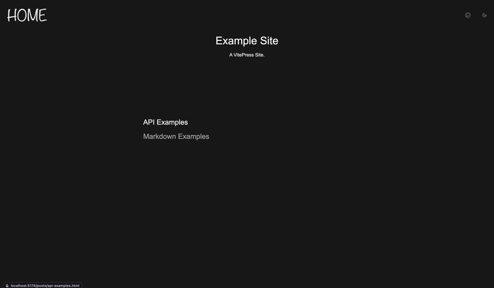

从零开始搭建博客网站（五）：文章列表。

---

[[toc]]

## 文章列表

### 现状

在 `PageContentHome.vue` 中可以看到，当前的文章列表是通过手写 DOM 添加的，这种重复性的工作显然是不应该存在的。

::: code-group

```vue [./docs/.vitepress/theme/components/PageContentHome.vue] {13-16}
<script setup lang="ts">
import { useData } from "vitepress";

const { site } = useData();
</script>

<template>
  <div class="mx-auto max-w-[700px]">
    <h1 class="m-4 text-center text-4xl">{{ site.title }}</h1>
    <div class="m-4 min-h-[200px] text-center">
      <p>{{ site.description }}</p>
    </div>
    <ul class="flex flex-col space-y-2">
      <li class="text-blue-500"><a href="/markdown-examples.html">Markdown Examples</a></li>
      <li class="text-blue-500"><a href="/api-examples.html">API Examples</a></li>
    </ul>
  </div>
</template>
```

:::

### 构建时数据加载｜Build-Time Data Loading

如果您的创造性足够强，也可以直接去看 [VitePress 官方文档](https://vitepress.dev/guide/data-loading#createcontentloader)。这里我会用我自己的方式来操作。

简要来说，对于目前的需求，我们需要提取所有文章的一些元数据，比如标题、发布时间、地址等，并渲染一个文章列表作目录使用。

所有的构建时数据加载都需要在 `*.data.ts` / `*.data.js` 文件中完成。我们在 `theme/` 文件下新建 `src/` 文件夹，并新建一个 `posts.data.ts` / `posts.data.js` 文件：

::: code-group

```ts [./docs/.vitepress/theme/src/posts.data.ts] twoslash
import { createContentLoader } from "vitepress";

export default createContentLoader("posts/*.md", {
  transform(raw) {
    return raw.map(({ url, frontmatter }) => ({
      url,
      frontmatter,
    }));
  },
});
```

:::

这里我们使用 VitePress 提供的 `createContentLoader()` 辅助函数来创建一个内容加载器。它的第一个参数是一个 glob 模式，用于匹配需要加载的文件。第二个参数是一个选项对象，用于配置加载器的行为。更细节的内容可以参考 [官方文档](https://vitepress.dev/zh/guide/data-loading#createcontentloader)。

在这里，我们匹配了 `posts/` 目录下的所有 `.md` 文件，并提取其 `url` 和 `frontmatter` 属性。在 `transform()` 成员中可以对数据进行操作，这里先不进行任何处理。

当然，我们需要把除了 `index.md` 外的所有的 MD 文件都放在 `./docs/posts/` 目录下。

或者如果您自己有管理文档和路由的思路，请自由发挥。

现在我们可以在 `PageContentHome.vue` 中使用导出的数据：

::: code-group

```vue [PageContentHome.vue (ts)] twoslash
<!-- 这两行红的没用，只是用来正确显示下面的 error，如果要复制粘贴，记得删掉。 -->
<script>  // [!code --]
// ---cut-start---
// @filename: ../src/posts.data.ts
import { createContentLoader } from "vitepress";

export default createContentLoader("posts/*.md", {
  transform(raw) {
    return raw.map(({ url, frontmatter }) => ({
      frontmatter,
      url,
    }));
  },
});
// ---cut-end---
</script>  <!-- [!code --] -->

<script setup lang="ts">
// @errors: 2614
// ...
import { data as posts } from "../src/posts.data"; // [!code ++]
// ...
</script>

<template>
  <!-- ... -->
</template>
```

```vue [PageContentHome.vue (js)]
<script setup>
// ...
import { data as posts } from "../src/posts.data"; // [!code ++]
// ...
</script>

<template>
  <!-- ... -->
</template>
```

:::

### 一些类型问题

不出意外的话，TS 用户又要出意外了。根据 [VitePress 文档](<https://vitepress.dev/zh/guide/data-loading#:~:text=%E4%BD%A0%E4%BC%9A%E6%B3%A8%E6%84%8F%E5%88%B0%20data%20loader%20%E6%9C%AC%E8%BA%AB%E5%B9%B6%E6%B2%A1%E6%9C%89%E5%AF%BC%E5%87%BA%20data%E3%80%82%E8%BF%99%E6%98%AF%E5%9B%A0%E4%B8%BA%20VitePress%20%E5%9C%A8%E5%90%8E%E5%8F%B0%E8%B0%83%E7%94%A8%E4%BA%86%20load()%20%E6%96%B9%E6%B3%95%EF%BC%8C%E5%B9%B6%E9%80%9A%E8%BF%87%E5%90%8D%E4%B8%BA%20data%20%E7%9A%84%E5%85%B7%E5%90%8D%E5%AF%BC%E5%87%BA%E9%9A%90%E5%BC%8F%E5%9C%B0%E6%9A%B4%E9%9C%B2%E4%BA%86%E7%BB%93%E6%9E%9C%E3%80%82>) 所述，VitePress 在后台调用了 `load()` 方法，将 `*.data.ts` / `*.data.js` 的默认导出用 `data` 具名导出来隐式暴露。所以在使用具名导入的时候，编译器会认为这个模块没有名为 `data` 的具名导出。

解决方法也很简单，在 `posts.data.ts` 中导出相应类型即可：

```ts twoslash
import { createContentLoader } from "vitepress";

export interface Data {  // [!code ++:3]
  // ...
}

declare const data: Data[];  // [!code ++:2]
export { data };

export default createContentLoader("posts/*.md", {
  transform(raw) {
    return raw.map(({ url, frontmatter }) => ({
      url,
      frontmatter,
    }));
  },
});
```

### 生成文章列表

在 `Data` 接口中，需要定义经过 `transform()` 后的属性。要做一个最基本的文章列表，我们需要每篇文章的链接和标题，其中标题可以在文章的 YAML 头中定义，从而通过上面的 `frontmatter` 访问：

::: code-group

```ts [posts.data.ts] twoslash
// ...
export interface Data {
  url: string;  // [!code ++:2]
  frontmatter: Record<string, any>;
}
// ...
```

```vue [PageContentHome.vue] {11-23}
<script setup lang="ts">
// ...
</script>

<template>
  <div class="mx-auto max-w-[700px]">
    <h1 class="m-4 text-center text-4xl">{{ site.title }}</h1>
    <div class="m-4 min-h-[200px] text-center">
      <p>{{ site.description }}</p>
    </div>
    <div>
      <div
        class="py-2 text-neutral-600 transition-colors duration-200 hover:text-neutral-900 dark:text-neutral-400 dark:hover:text-neutral-100"
        v-for="post in posts"
        :key="post.url"
      >
        <a
          class="text-2xl"
          :href="post.url"
          >{{ post.frontmatter.title }}</a
        >
      </div>
    </div>
  </div>
</template>
```

:::

当然，一定要确保每个 MD 文件都有 `title` 这个 frontmatter：

```markdown
---
title: "Example Title"
---
```

效果如下图所示：



