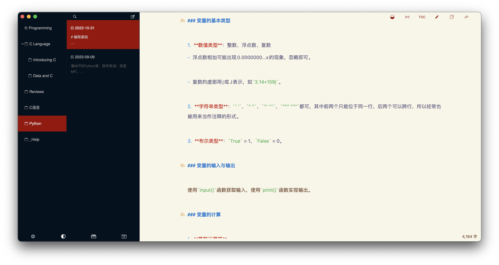
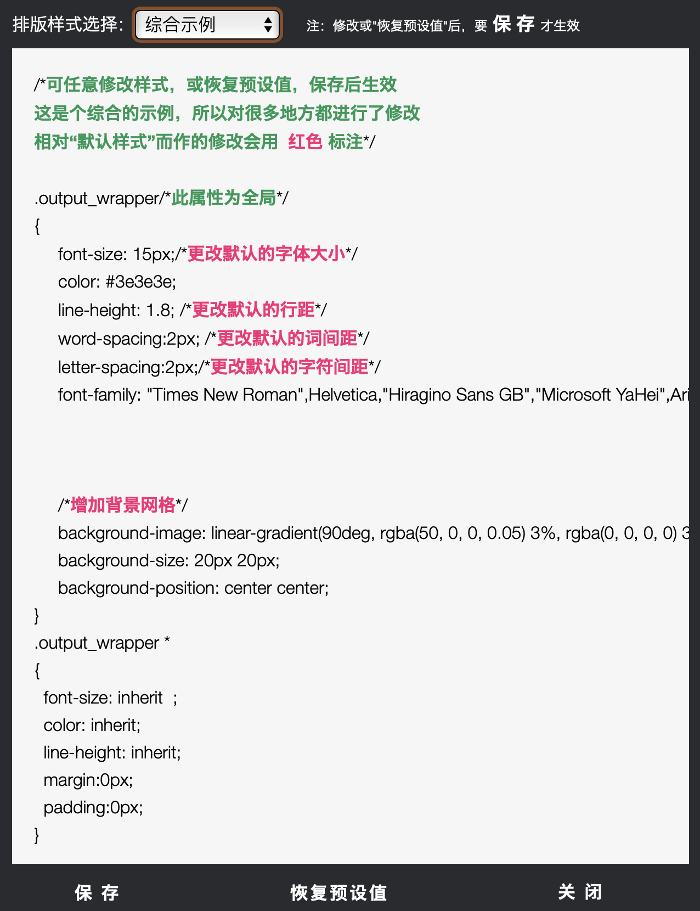
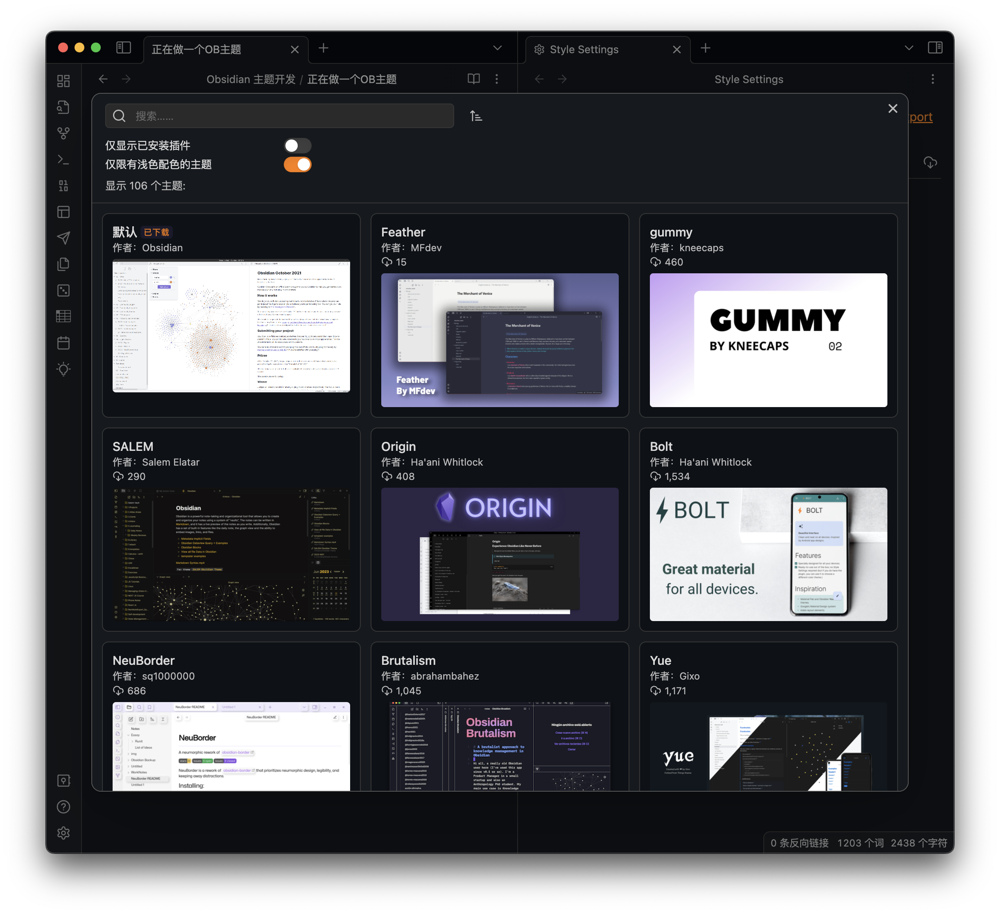
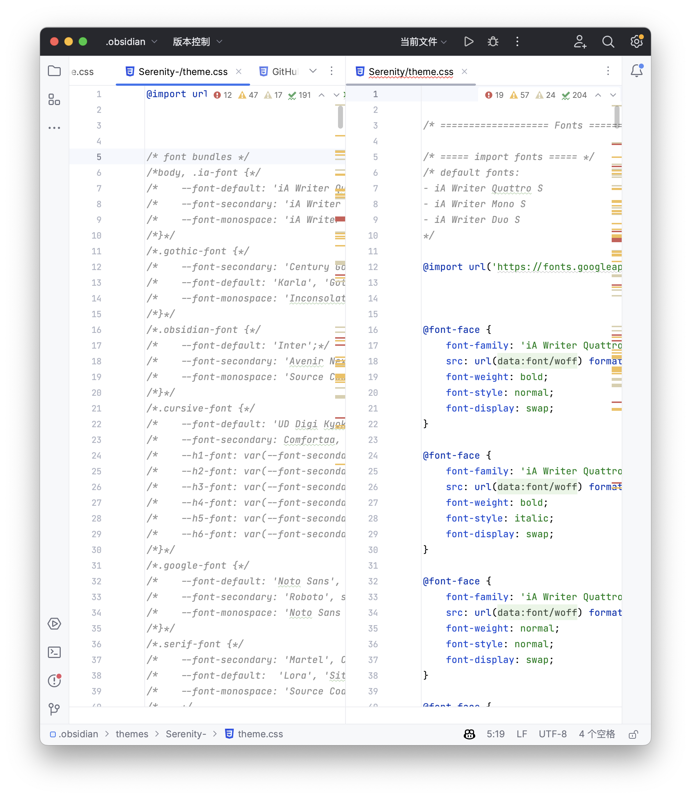
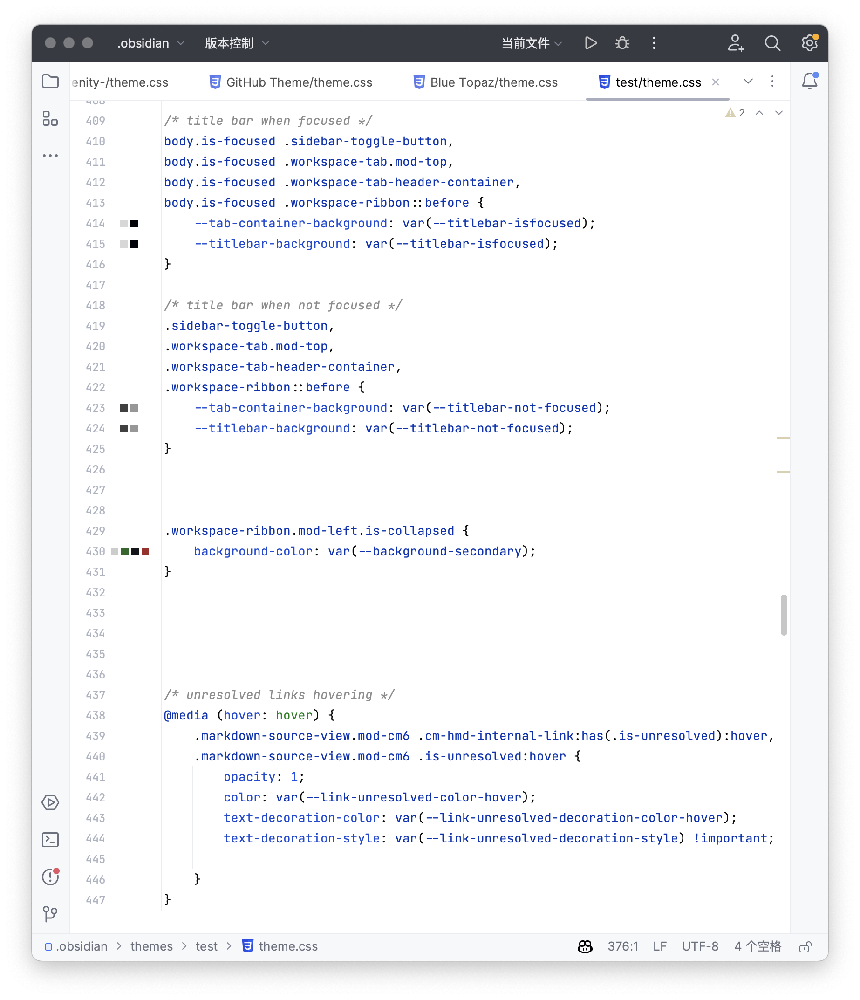

虽然在我认识的人里面用 Obsidian 的寥寥无几，但是还是想记录一下最近在干的事情。

---

[[toc]]

为什么突然想到自己做一个主题呢？

## metion——初识 Markdown

我用 [Obsidian](https://obsidian.md/) 快一年了，但是第一次接触它是在高考完的暑假。当时通过 [metion](https://apps.apple.com/cn/app/metion-中文写作者的笔记工具/id1530965242)（由于没找到官网所以放了 App Store 的链接）第一次接触到 Markdown，心想文本编辑还能这么玩？

> metion 宣传为「颜值高也好用，懂中文也懂 Markdown」。它的确成功地为中文写作进行了很大程度的优化：它支持在中英文字词之间自动添加空格；它支持中文的词性分析；它使用左右 shift 键能够在不切换输入法的情况下键入不同的符号（如对于中文的左书名号键，使用 `左shift` 能够键入 `《` ，而使用 `右shift` 能够键入 `>` ）；它支持将文本直接导出为公众号格式（懒得调格式的公众号作者福音）……

在那之后，我陷入了一阵对 Markdown 的狂热。我在 iPad 上下载了一大批支持 Markdown 的笔记软件，其中就包括 Obsidian。但是当时由于不太会用，加上 iPadOS 端的 Obsidian 还存在一些 bug，导致当时没有能够成功使用。其他的诸如 [Bear](https://bear.app/cn/)、 [Notion](https://www.notion.so/product?fredir=1)、 [Aganda](https://agenda.com)（严格意义上来说不算笔记软件）、 [MWeb](https://www.mweb.im/cn/index.html) 等等，我都进行了一定程度的体验。它们都是合格的 Markdown 编辑器，只是我口味比较刁。所以在一番尝试之后，我暂时还是用着 iPad 上的 metion 作为码字工具。

## MarkText——初识 CSS

metion 在很长一段时间内是我的主力写作工具，公众号前期的文章也都是用 metion 直接导出的格式。后来由于转战 Windows 平台，我又开始了一波试用和筛选，尝试了 [Typora](https://typora.io/#download)、 [Effie](https://www.effie.co)、 [CMD Markdown](https://www.zybuluo.com/cmd/) 等软件。后来由于 Typora 收费与不开源、Effie 对 Markdown 不完整的支持、CMD Markdown 不支持即时渲染等原因，我选择了一款号称 Typora 平替的开源免费 Markdown 编辑器： [MarkText](https://github.com/marktext/marktext)。

作为一个免费的软件，MarkText 几乎是超出了我的预期。在将近半年的使用中，我感到相当的舒适。在主要的编辑功能中，它与 Typora 基本无异，至少我没发现什么特别残缺的功能与特别恶性的 bug。但是由于失去了 metion 的「导出为公众号格式」，我需要折腾文章的格式的再复制上去。这个时期我用到了两个 Markdown 转公众号格式的网页来帮我进行格式化： [Md2All](http://md.aclickall.com) 和 [openwrite](https://md.openwrite.cn)。Generally speaking，后者的默认格式更符合我的审美，但是其缺少了对部分 Markdown 语法的支持，如使用 `[TOC]` 来生成一个 TOC 的功能 [^1]。所以在后期，我放弃了 openwrite，被迫学习了一部分 CSS 知识，用于在 Md2All 里对样式、排版等进行设计。

## Obsidian——NOW WE'RE TALKING

MarkText 说到底只是编辑器，而随着对笔记体系的逐渐完善，我开始产生对更高维度的功能的需求。恰逢此时，我接触到了 Zettelkasten。

::: info  
[Zettelkasten](https://en.wikipedia.org/wiki/Zettelkasten) 是德国社会学家 Niklas Luhmann 提出的概念，翻译成英语就是 Box of Notes，也即卡片盒笔记法，在这里不进行过多解释，感兴趣的朋友可以自己去了解。Obsidian 的理念与 Zettelkasten 非常兼容，它提供了双向链接、图谱视图、tag 和搜索等功能，便于创建、连接和浏览笔记，从而建立知识网络并使其逐渐丰富。  
:::

也正是这个时候，我开始正式地使用上了 Obsidian。不得不说，在接近两个学期的使用中，它确实为我提供了极大的帮助。虽然在早期，由于社区生态过于优秀，我一度疯狂捣鼓过插件主题，不过后来由于精力不足，加之我逐渐褪下了「形式主义」，便退烧了。

## 投身主题开发

退烧归退烧，需求还是有的。我始终感觉用别人做的东西不太舒服。制作者毕竟很难无微不至地考虑到每一个用户的需求。

在刚萌生开发主题这个想法的时候，我的策略是对已有的、相对较完善的主题 CSS 进行修改，基于 [Style Settings](https://github.com/mgmeyers/obsidian-style-settings) 插件对其提供的设置接口进行调整，并增加我认为重要的、常用的设置选项。

但是在一段时间后，我发现这样的方式极度依赖于原主题作者的代码，导致我对代码的理解能力几乎没有进步，操作流程基本是注掉、看区别、适当修改的流水线，效率极低且没有收益。所以再三思考后还是决定自己从头开始写一个，也当作学前端了。

目前整个开发还处于很前期的阶段，除了提供了一些配色更改的设置、对一些内置样式如 **strong**、*emphasis*、==highlight== 进行了修改之外，UI 的美化、其他元素（ol、il、code、callout 等）的样式设计、文章排版之类的任务还暂时没有进行。不过问题不大，早晚而已。

前两天在 puq 发的那个「调查」，就是由于我发现在中文编辑中，斜体的应用面似乎很窄，所以在考虑要不要弃用掉 italic 的设计而将 `<em>` 元素应用其他的样式。还在思考中。

---

这次扯得有点多。希望下次能少扯点。

[^1]: 2024 年 9 月 9 日补充，使用 `[toc]` 生成大纲目录并不是标准的 CommonMark 规范。
