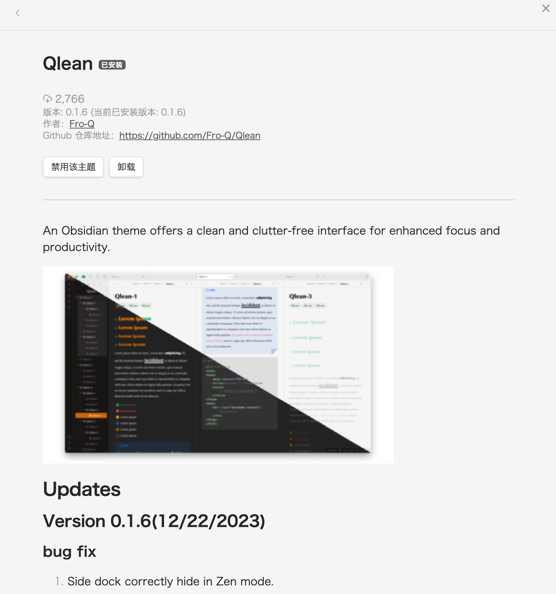
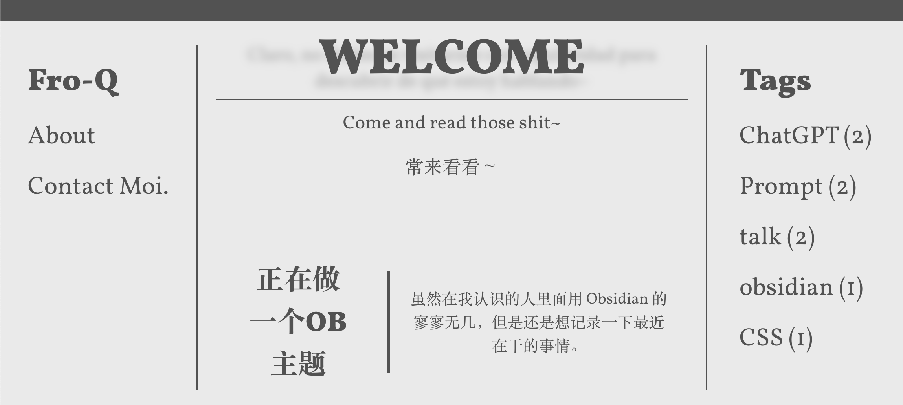
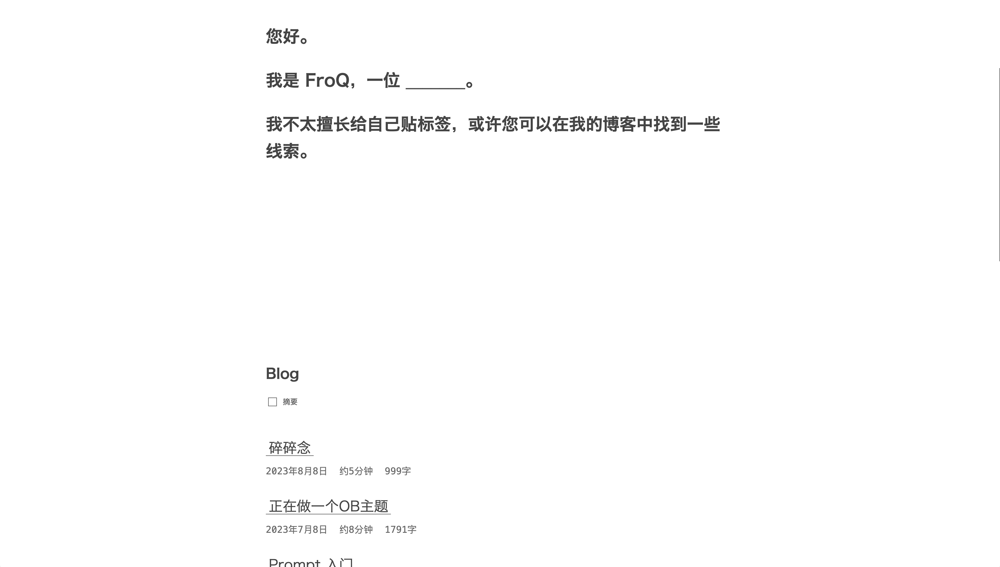

我 xxx 又回来啦！

---

[[toc]]

您好。

## 很久

很久没下笔（手），对写作似乎有点陌生了。

我上一篇文章应该是 23 年 8 月 8 日的 [碎碎念](https://mp.weixin.qq.com/s/hxOJcdqRqdSpMoTBv5uJEw)，已经过去 5 个多月了。我不知道会不会有人觉得我不更了，应该有吧。我还是得再说一次，写博客写日记写随笔这点事情，我大概会一直坚持下去，可能在比较忙的阶段会迟到，不过肯定会来的。

我在这期间不止一次地想写点东西，但是一方面被各种学习任务压得不是很喘得过气，一方面我在一遍一遍读了之前的文章后，发现了一些我必须要花时间去想的问题。

## 问题

不知道大家是什么感觉。我现在再读我之前的文章，观感不是很好。不管是内容、风格，还是具体的遣词造句，都很难不给人一种故弄玄虚的感觉。在我自己的认知里面，我写文章主要是为了记录，顺便进行分享与交流。但后来，我的很多文章似乎都不再是为了纯粹的记录，而更像是一种「展示」。

既然文章会被公布出来，那自然是有一定的「展示」的成分在里面。但这种「展示」，应该是将字句向更易读的方向优化，而非为了专业性进行无谓的堆砌。

I made a mistake.

所以我想着，等到我完全「自由」下来，我会去想想我到底应该写什么样的文章。所以写作的事情就一直拖到了寒假。

## 坑

从去年开始鼓捣 [博客园](https://www.cnblogs.com/ypsr) 起，我陆陆续续为自己挖了很多坑。这里可以整理一下：

- 3 月 23 日我在自己的日记里提到了「*想学 CSS，初步感觉用处很大，包括但不限于调整公众号格式、Obsidian 格式等等等等格式……*」，28 日又提到「*想搞**个人博客**，码在这…*」。
- 在 6 月 1 日的 [好久不见:P](https://mp.weixin.qq.com/s/OnDiN2K2UIo1H4oQK3J7xA) 里，我提到我在鼓捣博客网站，在 [博客园](https://www.cnblogs.com/ypsr) 上有了一个成品，但由于三件套不熟练所以仅限于基于模版的小改动。此外，我目前在用的是 [Gridea](https://open.gridea.dev)，它提供了一个客户端可以直接上传（甚至直接在内置编辑器中撰写） md 文档并生成静态站点，非常友好。
- 7 月 8 日，我写了一篇名为「正在做一个 OB 主题」的文章，但没发在公众号上，感兴趣的话可以去 [看看](https://fro-blo.com/blog/making-obsidian-theme.html)。在这篇文章里，我大概讲了一下我为什么要自己做一个主题，顺便讲了自己写文章鼓捣「工具」的历史。我从 metion 接触 markdown，在转向使用 MarkText 后开始研究文章的输出样式，并接触 CSS，而后开始使用 Obsidian，并由于对编辑器外观的需求开始着手主题开发。这时主题开发还处于大前期，「除了提供了一些配色更改的设置、对一些内置样式如 strong、emphasis、highlight 进行了修改之外，UI 的美化、其他元素（ol、il、code、callout 等）的样式设计、文章排版之类的任务还暂时没有进行」。
- 8 月 8 日，在 [碎碎念](https://mp.weixin.qq.com/s/hxOJcdqRqdSpMoTBv5uJEw) 中我提到，Obsidian 的主题已经交 pull request 了（虽然在那以后一个星期还在不断处理打回来的请求），由于 Gridea 改样式不方便所以想自己做个 App 实现 md-to-HTML 的转换以及整个站点文件树的生成（这个想法确实有点年轻了），报考了三级网络技术。

总结下来就两件大事：Obsidian 主题和博客网站。

## Obsidian 主题

我现在在用的就是自己写的 [Qlean](https://github.com/Fro-Q/Qlean)。有一说一我觉得用户体验还算可以。

这是截至 1 月 28 日 13 时 40 分的数据。2000 多的下载量虽然不多，但我能感受到我花时间花精力去做的东西确实得到了部分人的认可，这就够了。如果有朋友用 Obsidian，不妨试一试它，有 bug 或者有什么需求和想法可以直接联系我。

不过由于在大概 10 月底，我做更新的时候不小心把 scss 源文件弄丢了，导致重写的时候可能多了很多小 bug，现在也没完全解决，所以再说一遍如果发现了 bug 一定要联系我（求）。

## Fro-blo

哈哈，这就是我给我的博客网站取的名字，域名已经注册了，可以直接去 https://fro-blo.com/ 访问。blo 代表着 blog 比较好理解，fro 我可能需要解释一下。在开始做 Qlean 的开发后，我在各种网站媒体上使用的名称一律变成了 FroQ，「fro」 代表 「frog」 青蛙，「Q」 也就是我，又刚好「froq」和「frog」词形读音都相近，综上我认为它是一个相当成功的社交名。

在这之前，我其实还用纯 Vue. js 写过一个版本，长这样：

其实效果还可以，我也挺满意的。不过这两天用 Vitepress 重新做了一个，也就是现在大家看到的这个，整体观感可能会更好吧。

说实话，在做这个玩意的过程中一直在不断学习。当初我以为我看了几天 Vue 的文档已经把它完全掌握了，结果后来自己做另一个 GIS 可视化项目的时候发现之前的全是粑粑，然后现在回头看那个可视化项目也跟粑粑一样。不过没事，至少说明我进步显著。

后面我可能会陆陆续续把自己这一路来踩的坑和全流程记录发出来，大家伙如果有也想搞这个的可以咨询我。

---

好了好了，不要一次把话都说完了，免得下次没得说。
